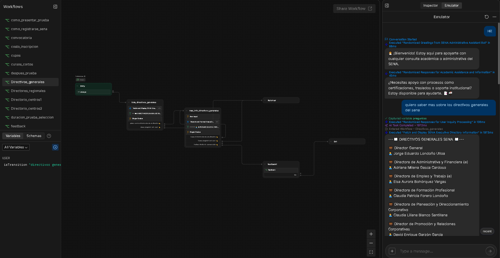
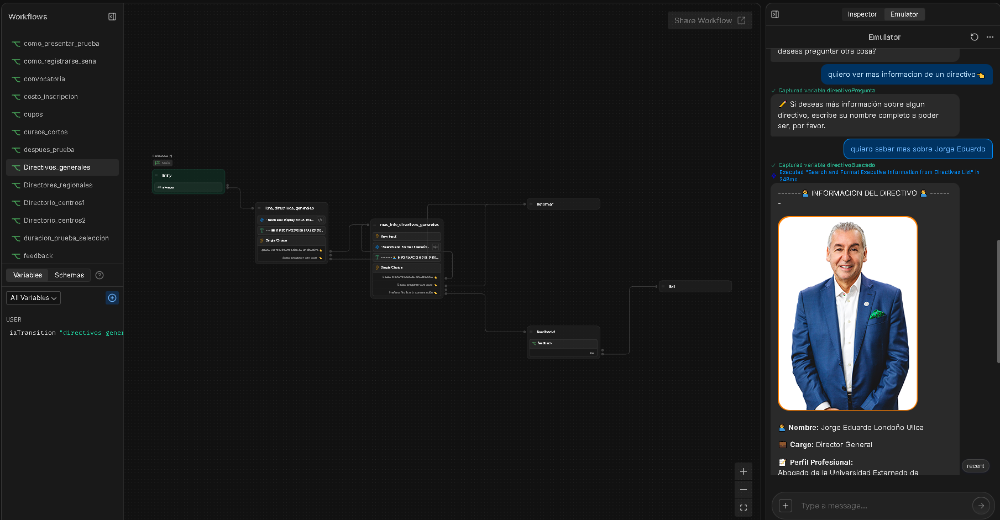
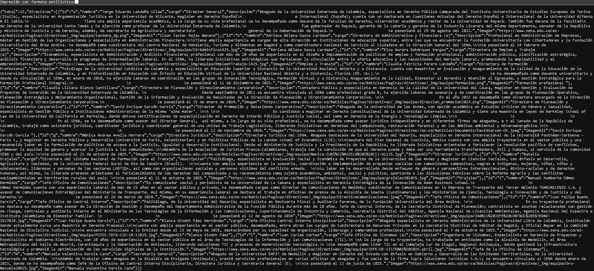
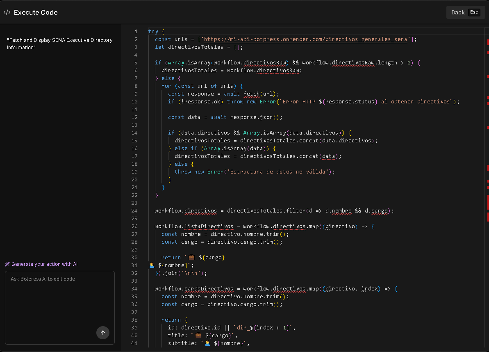
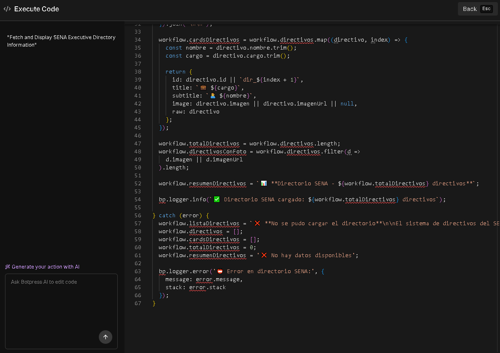

# 🤖 Chatbot Administrativo Virtual SENA — Backend Scraping API 🌐

Backend desarrollado en **Node.js + Express** encargado de realizar **Web Scraping dinámico** sobre páginas oficiales del SENA y plataformas relacionadas como SOFIA Plus, con el objetivo de suministrar información actualizada a un **chatbot asistente administrativo virtual inteligente del SENA**.

Este servicio funciona como una capa intermedia que transforma contenido web institucional en datos estructurados JSON listos para consumo por sistemas conversacionales, RAG e interfaces web.

Proyecto desarrollado como parte de la formación **Tecnologo ADSO — Análisis y Desarrollo de Software del SENA**.

---

## 🧠 Funcionalidades Principales

- 📡 Scraping automático desde páginas oficiales del SENA
- 🤖 Integración directa con Botpress Cloud
- 📚 Extracción de preguntas frecuentes institucionales
- 🎓 Consulta de programas de formación
- 🏢 Directorios administrativos por centros
- 🧾 Guías visuales SOFIA Plus
- 🧪 Información sobre pruebas de selección
- 🔎 Búsqueda avanzada de programas
- 🌍 API REST consumible desde cualquier frontend

---

## 🛠️ Tecnologías Utilizadas

- Node.js
- Express.js
- Axios
- Cheerio
- HTTPS Agent
- UUID
- CORS
- Render (Deploy en la nube)
- Botpress Cloud (Integración chatbot)

---

## 📊 Arquitectura General

Usuario  
⬇  
Chatbot (Botpress)  
⬇  
Backend Scraping API  
⬇  
Páginas Oficiales SENA  
⬇  
Datos JSON estructurados  
⬇  
Respuesta inteligente al usuario

---

## Ejemplo de uso de la API

- Uso de la API por Botpress Cloud
<div align="center">
  
  
 
</div>

- JSON capturado por la API
<div align="center">
  
</div>

- Como Botpress Cloud Transforma el JSON
<div align="center">
  
  
</div>

---

## 🚀 Instalación y Uso

### 1️⃣ Clonar repositorio

```bash
git clone URL_DEL_REPOSITORIO
cd backend-chatbot-sena
```

### 2️⃣ Instalar dependencias

```bash
npm install
```

### 3️⃣ Ejecutar servidor

```bash
npm start
```

### Servidor local:

```bash
http://localhost:3000
```

---

**Autor**
- Jeison Alexis Rodriguez Angarita 🙍‍♂️
- Proyecto Productivo / Tecnologo ADSO (Analisis y Desarrollo de Software / SENA 👨‍🎓
- 2025 📅 


